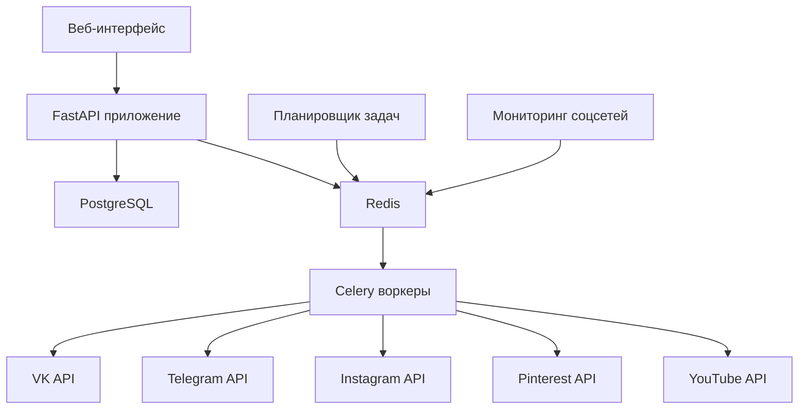

# Архитектура CrossPoster

## Обзор

CrossPoster - это приложение для автоматического кросспостинга контента между различными социальными сетями. Приложение отслеживает новые публикации в подключенных социальных сетях и автоматически репостит их во все остальные сети.

## Технологический стек

- **Язык программирования**: Python 3.9+
- **Веб-фреймворк**: FastAPI
- **База данных**: PostgreSQL
- **Очередь задач**: Celery с Redis
- **Контейнеризация**: Docker и Docker Compose
- **Миграции БД**: Alembic

## Архитектура системы

## Компоненты системы

### 1. Веб-интерфейс (FastAPI)
Основной компонент, предоставляющий REST API для управления приложением:
- Управление учетными записями социальных сетей
- Просмотр статистики постинга
- Мониторинг состояния системы

### 2. База данных (PostgreSQL)
Хранит следующую информацию:
- Учетные данные пользователей
- Токены доступа к социальным сетям
- Информацию о постах
- Статистику постинга

### 3. Очередь задач (Redis + Celery)
Обеспечивает асинхронную обработку задач:
- Мониторинг социальных сетей на наличие новых постов
- Репостинг контента между социальными сетями
- Обработка медиафайлов

### 4. Планировщик задач (APScheduler)
Регулярно запускает задачи проверки социальных сетей на наличие новых публикаций.

### 5. Клиенты социальных сетей
Отдельные модули для работы с API каждой социальной сети:
- VK
- Telegram
- Instagram
- Pinterest
- YouTube Shorts

## Структура базы данных

### Таблицы

1. **users** - Пользователи админ-панели
2. **social_accounts** - Учетные записи социальных сетей
3. **posts** - Информация о постах
4. **statistics** - Статистика постинга

## Развертывание

Приложение развертывается с использованием Docker Compose и включает следующие сервисы:
- Веб-приложение (FastAPI)
- Worker (Celery)
- Планировщик задач
- База данных (PostgreSQL)
- Redis

## Масштабируемость

Архитектура приложения позволяет легко добавлять новые социальные сети:
1. Создание нового клиента для API социальной сети
2. Добавление соответствующих задач Celery
3. Обновление моделей базы данных при необходимости
4. Добавление поддержки в веб-интерфейс

## Безопасность

- Хранение токенов в зашифрованном виде в базе данных
- Использование переменных окружения для конфиденциальных данных
- Ограничение доступа к API через аутентификацию