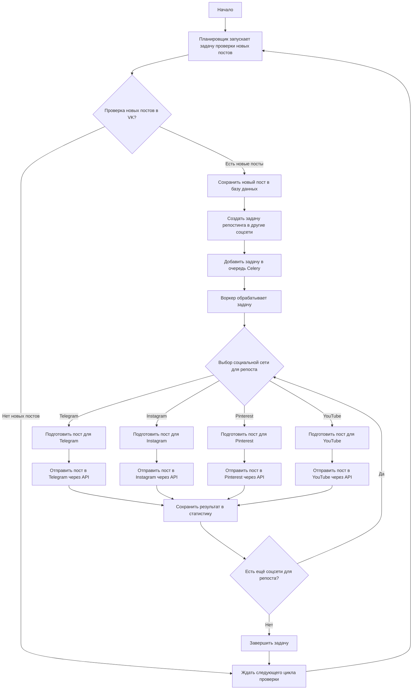
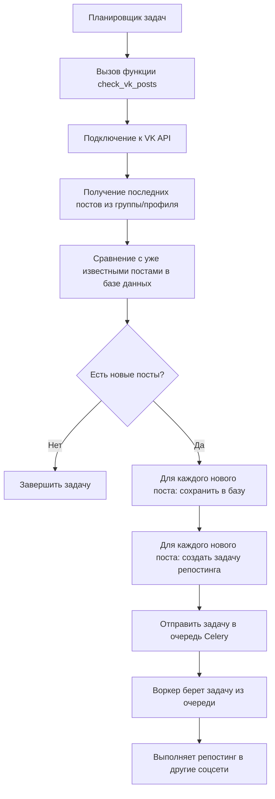
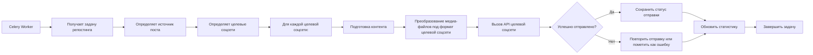

# Блок-схема процесса кросспостинга в CrossPoster

## Общий процесс кросспостинга



## Подробный процесс проверки новых постов



## Процесс репостинга через Celery



## Архитектура системы

```mermaid
graph TB
    subgraph "Клиентская зона"
        A[Web API] 
        A1[Пользовательский интерфейс]
    end
    
    subgraph "Серверная зона"
        B[База данных PostgreSQL]
        C[Redis (брокер сообщений)]
        D[Celery Workers]
        E[Планировщик (Scheduler)]
    end
    
    subgraph "Социальные сети"
        F[VK API]
        G[Telegram API]
        H[Instagram API]
        I[Pinterest API]
        J[Youtube API]
    end
    
    A <--> B
    A <--> C
    E --> D
    D --> C
    D --> B
    D --> F
    D --> G
    D --> H
    D --> I
    D --> J
```

## Процесс добавления новых социальных сетей

```mermaid
graph TD
    A[Разработчик] --> B[Создает новый клиент для социальной сети]
    B --> C[Наследует базовый класс социального клиента]
    C --> D[Реализует методы: get_latest_posts, post_to_channel]
    D --> E[Добавляет в систему задач Celery]
    E --> F[Регистрирует в планировщике]
    F --> G[Тестирует интеграцию]
    G --> H[Обновляет документацию]